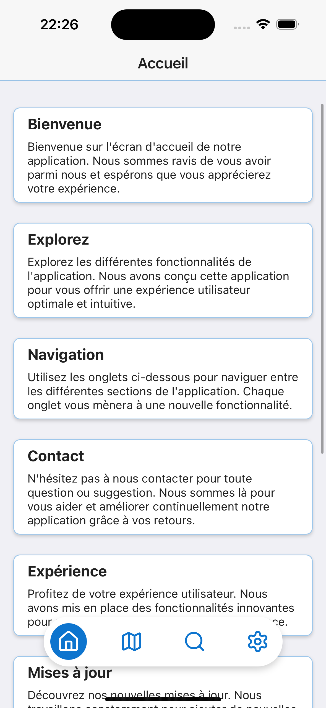
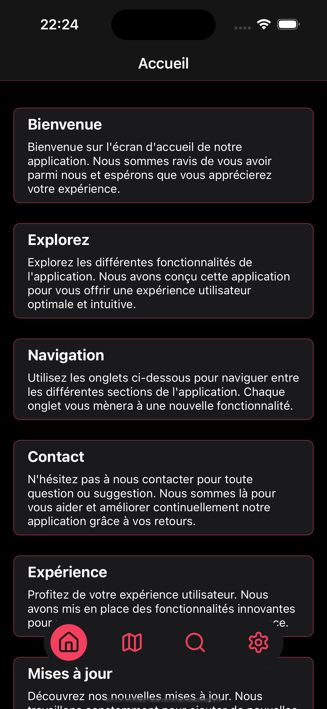
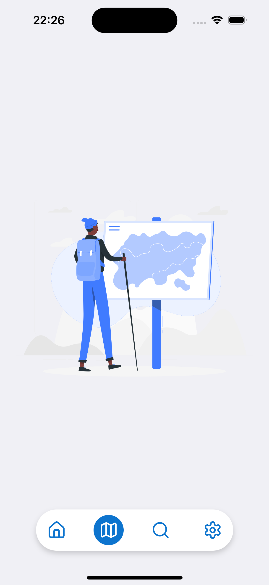
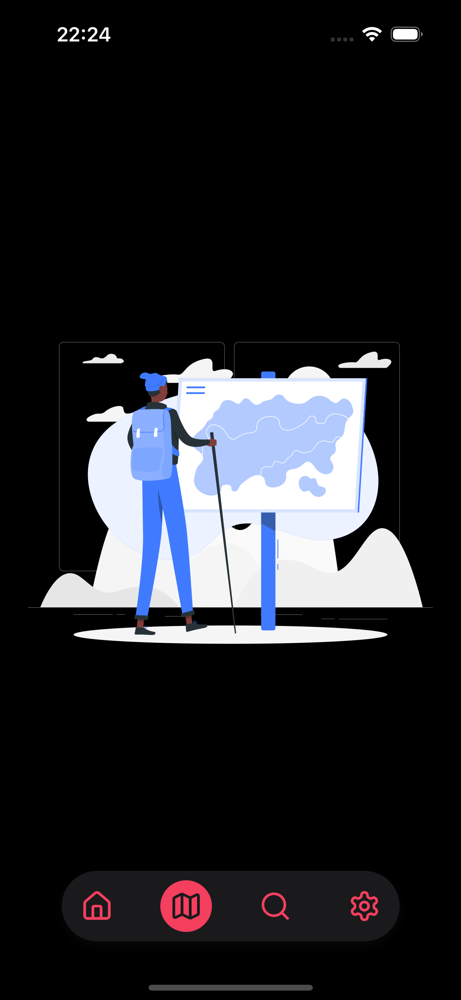
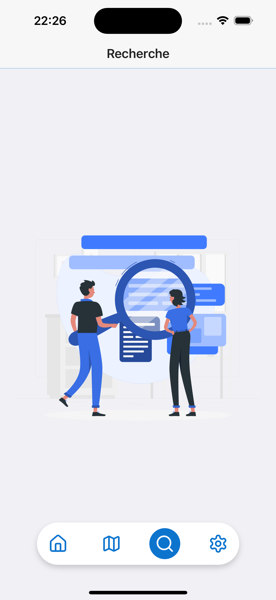
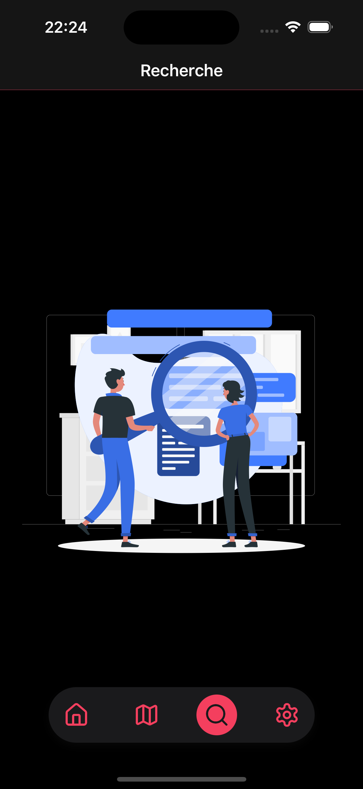
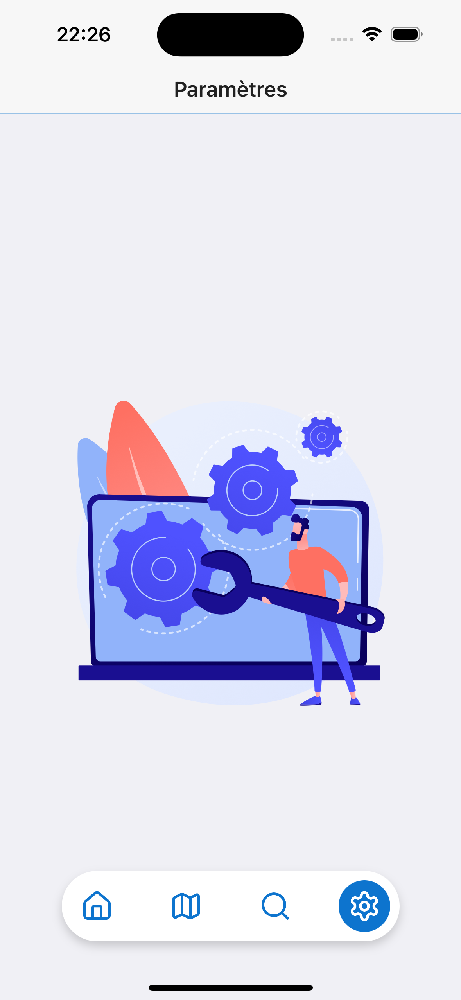
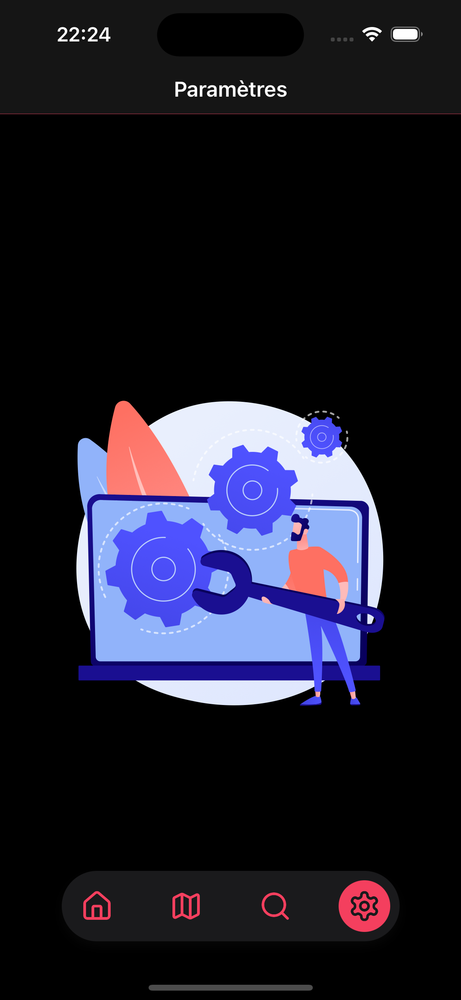

# Example themed app with floating bottom bar

## Features

- Floating bottom bar
- Light/dark mode
- Spacing / Colors / Borders / Shadows constants

### Constants

It is easy to adjust the spacing, colors, borders, and shadows of the app. The constants are defined in the
`src/constants` folder.

For colors, it supports light and dark mode.

```ts
export const Colors = {
  light: {
    tintColor: '#0d74ce',
    headerBackground: '#f7f7f7',
    background: '#F0F0F5',
    text: '#212121',
    surface: '#FFFFFF',
  },
  dark: {
    tintColor: '#f43f5e',
    headerBackground: '#151515',
    background: '#000000',
    text: '#FFFFFF',
    surface: '#1A1A1C',
  },
}
```

## Screenshots

| Écran      | Light                                    | Dark                                    |
|------------|------------------------------------------|-----------------------------------------|
| Accueil    |  |  |
| Carte      |            |            |
| Recherche  |      |      |
| Paramètres |  |  |

## Development

1. Install dependencies

   ```bash
   pnpm install
   ```

2. Start the app

   ```bash
    pnpm run dev
   ```
